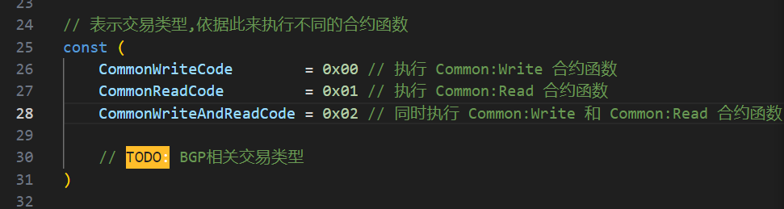
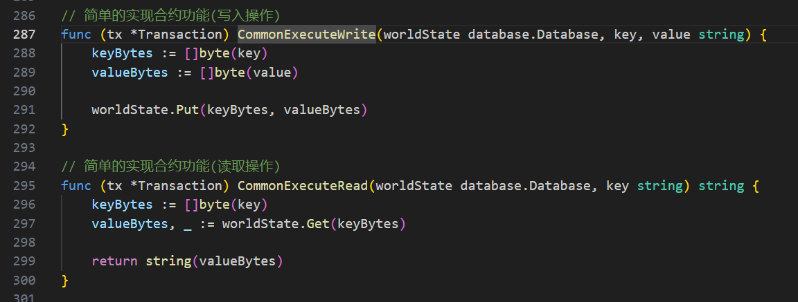
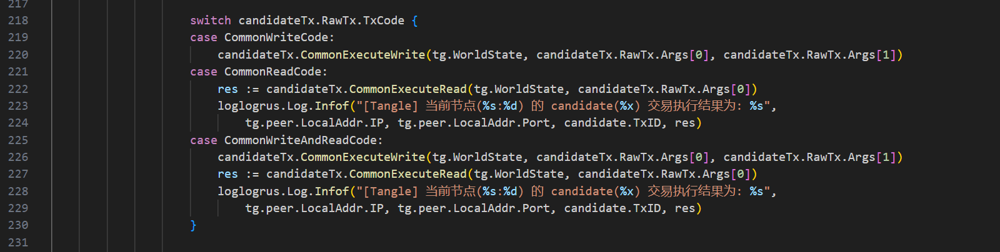

### 一、`tangle`节点的初始化配置项：

`tangle`节点的主程序代码位于`tanglePeer.go`文件中。

- `peerIP`：`Tangle`节点之间进行`p2p`通信的`IP`地址
- `peerPort`：`Tangle`节点之间进行`p2p`通信的`Port`
- `peersTable`：`Tangle`集群中所有节点的地址
- `sendRate`：节点发送交易的速率
- `txCD`：一笔交易从发布到上链所需的确定时延
- `powDiff`：节点生成交易时的pow难度

### 二、合约模块

合约模块代码位于`/tangle/transaction.go`中，当发布的交易到达允许的验证时间后，将会调用合约模块进行交易执行。

目前已经提供了模板合约`Common`，具有`Common:Write`和`Common:Read`两个合约函数。

1. 注册交易码(包含合约名和合约函数)

2. 注册合约函数

3. 合约执行(在`/tangle/tangle.go`的`tangle.UpdateTipSet()`中)

​	交易被确认后，在上链前，需要执行交易：

用户可以自行实现自定义合约。

### 三、发布交易

因为`tangle`是公链协议，每个节点既是服务端也是客户端。也就是说`tangle`节点自己就是用户的客户端，将用户发布的交易上传至`tangle`网络中，随后参与`DAG`共识。

- `tangle.PublishTransaction()`用户发布交易，分别指定参量和合约名以及合约函数。
- `tangle.BackTxCount()`：返回当前节点已完成上链的交易数量。

